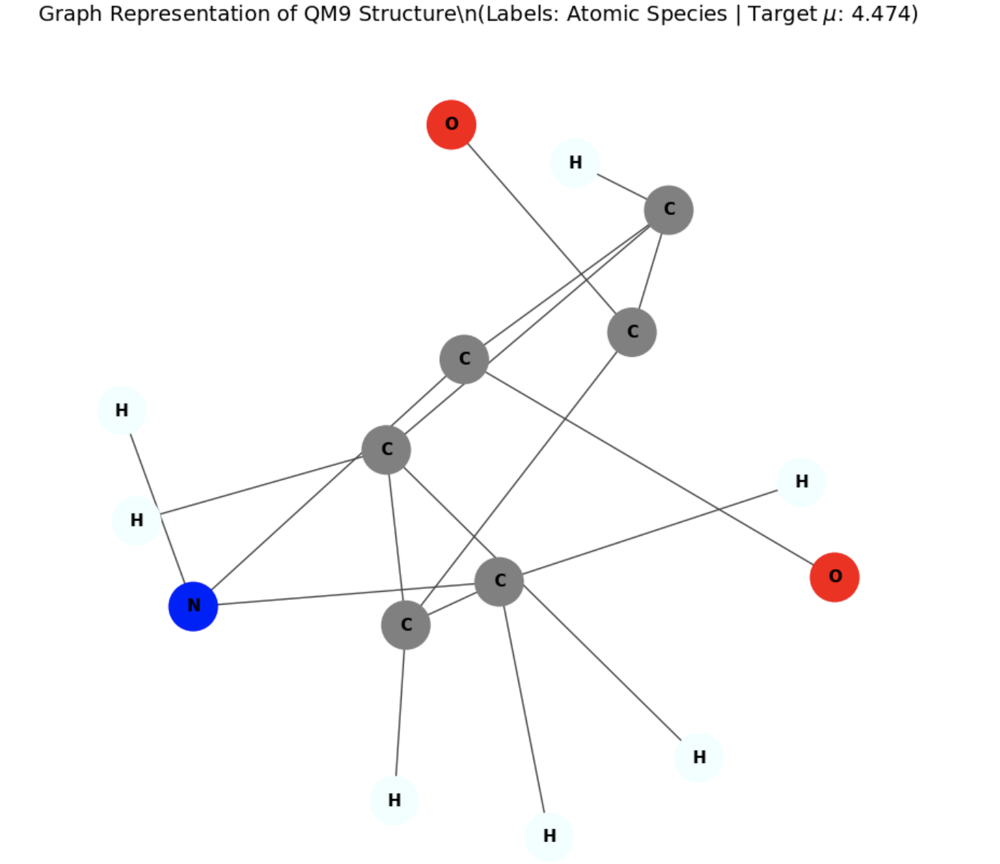
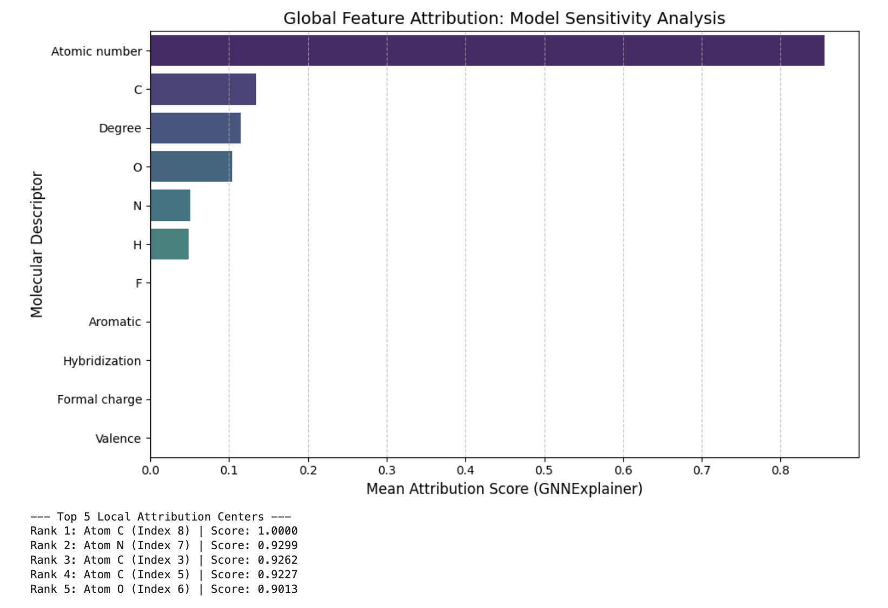
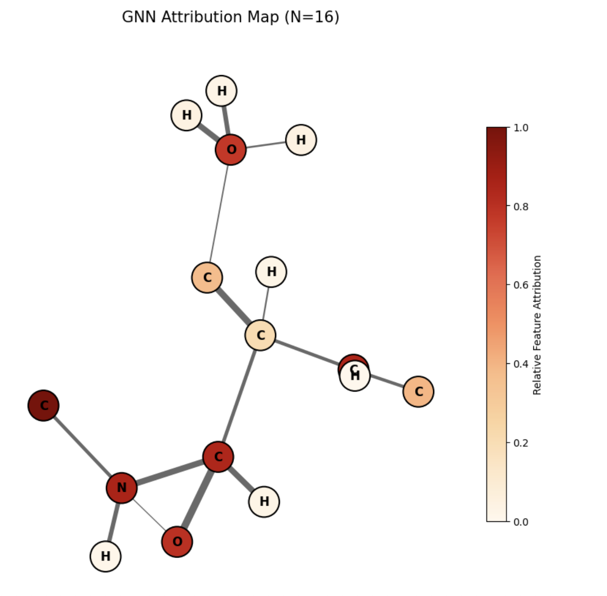
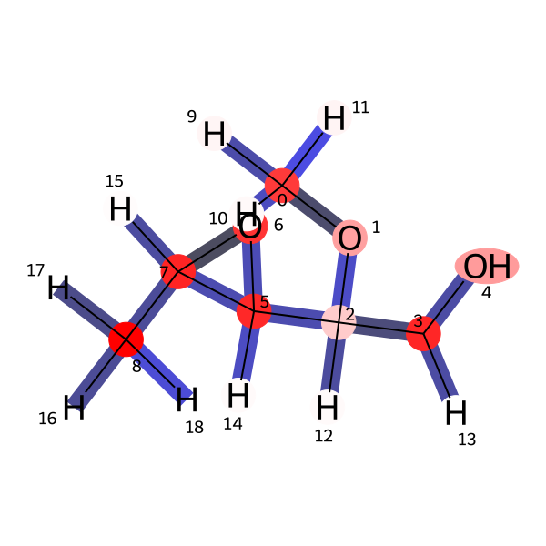

## Overview
This project implements a **Geometric Deep Learning framework** for predicting molecular dipole moments ($\mu$) using the QM9 dataset.

A Message Passing Graph Neural Network is used to learn molecular representations directly from atomic structure and bond interactions.

The main goal is to combine **strong predictive performance with interpretability grounded in chemical principles**.

---

## Molecular Representation

Molecules are represented as graphs:
- Nodes → atoms  
- Edges → chemical bonds  
- Features → atomic number, molecular connectivity, and 3D spatial coordinates  

This representation allows the model to learn directly from molecular structure without handcrafted descriptors.

---

## Model Architecture

- Message Passing Graph Neural Network (MPGNN)  
- Graph convolution layers for neighborhood aggregation  
- Global additive pooling for molecule-level embedding  
- Regression head for dipole moment prediction  

---

## Explainability (GNNExplainer)

To interpret predictions, GNNExplainer is used to generate node and edge importance masks.

---

### Global Feature Sensitivity

The model prioritizes:
- atomic number  
- electronegative atoms (O, N)  

**Insight:**  
The model learns representations that align with chemically relevant features influencing molecular polarity.

---

### Structural Attribution Map

Node and edge importance scores highlight functional groups contributing to molecular dipole behavior.

**Insight:**  
Attribution is concentrated around polar bonds and functional groups (e.g., C–O, C–N), indicating meaningful structural learning.

---

### Saliency Map (RDKit Visualization)

Chemical visualization using RDKit highlights atomic-level contributions.

**Insight:**  
The model assigns higher importance to electronegative atoms and lower importance to hydrogen atoms, consistent with chemical intuition.

---

## Results

- Accurate prediction of molecular dipole moments on QM9 dataset  
- Strong alignment between learned representations and chemical structure  
- Identification of functional groups driving molecular polarity  
- Effective interpretability using post-hoc explainability methods  

---

## Engineering Insights

- Graph structure is essential for molecular learning  
- Message passing captures electronegativity-driven interactions  
- Explainability validates chemically meaningful representations  
- GNNs function as both predictive and analytical tools  

---

## Status
📊 Research-grade project — completed with full explainability and visualization pipeline.