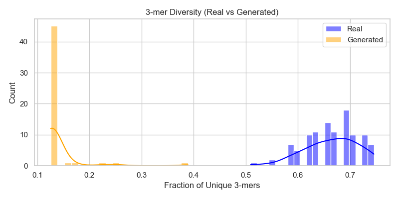
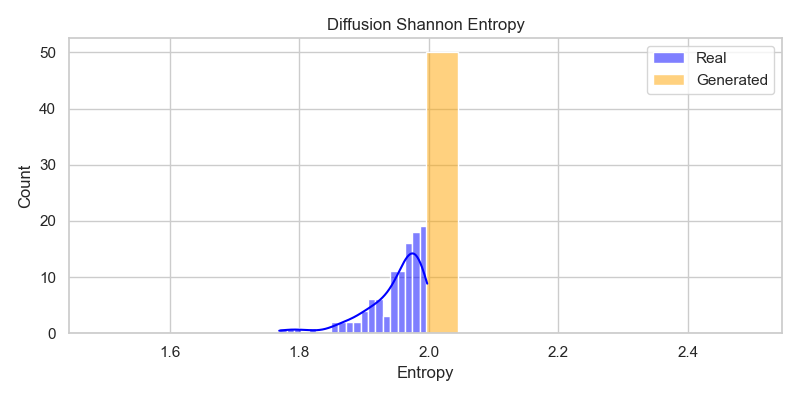
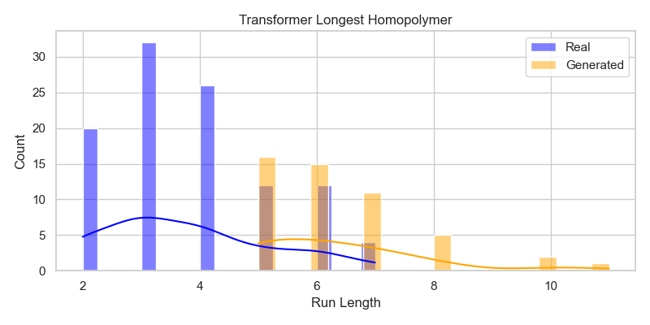

## Overview
GenomicSeqAI is a deep learning framework for **genomic sequence prediction and generation** using Transformer and diffusion-based architectures.  
The system evaluates biological realism using structured metrics including GC content, k-mer diversity, Shannon entropy, and homopolymer statistics.

The goal is to bridge **generative modeling** with **biological validity constraints** in synthetic DNA generation.

---

## Results & Evaluation

The generative models were evaluated across multiple biological and statistical metrics to assess how well they capture genomic structure compared to real sequences.

---

### 🧬 GC Content Distribution
The model successfully captures **global nucleotide composition**, maintaining biologically realistic GC content distributions aligned with real genomic data.

**Insight:**  
The generated sequences closely match the real GC distribution, indicating strong learning of macro-level genomic constraints.

---

### 🔀 K-mer Diversity (3-mer Analysis)
K-mer diversity reveals how well the model captures **local sequence structure and motif variability**.

**Insight:**  
Generated sequences show reduced diversity compared to real DNA, indicating partial **mode collapse** and overuse of recurring motifs.

---

### 🌡️ Shannon Entropy (Diffusion Model)
Entropy measures sequence complexity and randomness.

**Insight:**  
The diffusion model exhibits a sharp entropy concentration near **maximal uniformity**, suggesting loss of natural biological irregularities.

---

### 🧬 Homopolymer Run Analysis
Homopolymers (repeated nucleotides) indicate structural stability or degeneration in generated sequences.

**Insight:**  
Transformer models tend to produce **longer homopolymer runs** than real sequences, indicating limitations in sequential precision and token-level control.

---

## Engineering Insights & Limitations

This evaluation highlights key structural gaps in generative genomic modeling:

- **Mode Collapse:** Reduced k-mer diversity indicates over-reliance on limited motifs  
- **Over-Uniformity:** Diffusion models produce overly uniform entropy distributions  
- **Repetition Drift:** Transformer architectures generate excessive homopolymer runs  

---

## Future Improvements

To improve biological realism:

- Introduce **k-mer regularization loss** to improve local diversity  
- Apply **length-aware positional encoding** to reduce homopolymers  
- Add **structure-aware constraints** during decoding  
- Explore hybrid Transformer–Diffusion architectures  

---

## Status
📊 Active research project — continuously improving generative fidelity and biological alignment.