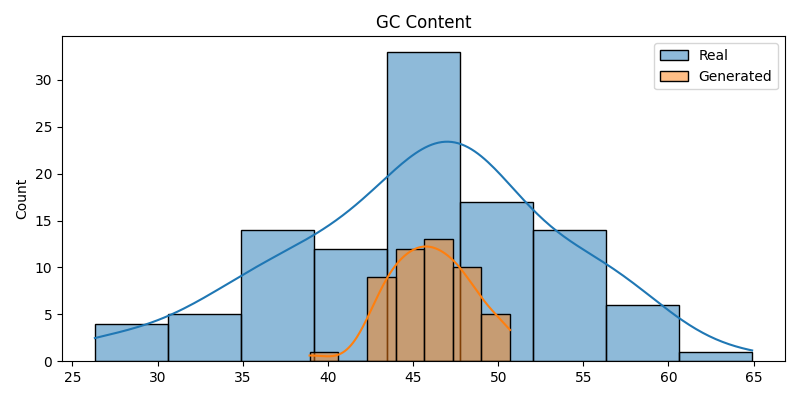

## Overview
GenomicSeqAI is a deep learning framework for **genomic sequence prediction and generation** using Transformer and diffusion-based architectures.

The system evaluates biological realism using multiple metrics including GC content, k-mer diversity, Shannon entropy, and homopolymer statistics.

The goal is to bridge **generative modeling and biological validity constraints** in synthetic DNA generation.

---

## Results & Evaluation

The models were evaluated using multiple biological and statistical metrics to assess how closely generated sequences match real genomic structure.

---

### 🧬 GC Content Distribution
The model successfully captures **global nucleotide composition**, producing GC distributions closely aligned with real genomic data.

**Insight:** Generated sequences preserve realistic base composition, indicating strong learning of global genomic constraints.

---

### 🔀 K-mer Diversity (3-mer Analysis)
K-mer diversity evaluates how well the model captures local sequence structure and motif variation.

**Insight:** Generated sequences show reduced diversity, indicating partial mode collapse and overuse of repeated motifs.

---

### 🌡️ Shannon Entropy (Diffusion Model)
Entropy measures sequence randomness and complexity.

**Insight:** The diffusion model shows overly uniform entropy distribution, suggesting loss of natural biological variability.

---

### 🧬 Homopolymer Analysis
Homopolymers measure repetitive nucleotide runs in generated sequences.

**Insight:** Transformer models generate longer repetitive runs compared to real sequences, indicating limitations in sequential control.

---

## Engineering Insights

Key limitations identified:

- Mode collapse in local motif generation  
- Over-uniform distributions in diffusion outputs  
- Repetition drift in Transformer-based decoding  

---

## Future Improvements

- Add k-mer regularization to improve diversity  
- Introduce length-aware positional encoding  
- Apply structure-aware decoding constraints  
- Explore hybrid Transformer–Diffusion architectures  

---

## Status
📊 Active research project — continuously improving generative biological fidelity.