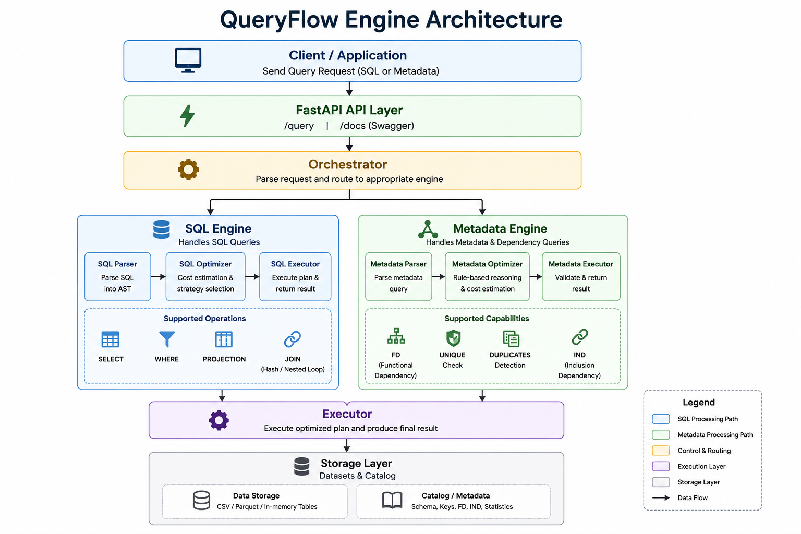

## Overview
This project implements a **modular database engine simulation** that replicates internal DBMS query processing. It integrates a SQL execution engine, metadata reasoning system, and cost-based optimizer exposed via a FastAPI backend.

The system follows the classical database pipeline:

**Parse → Plan → Optimize → Execute**

---

## System Architecture

The architecture models two independent execution paths:

- SQL execution pipeline
- Metadata reasoning pipeline

---

## SQL Execution Engine

- SQL parsing into structured representations
- In-memory query execution
- Supports SELECT, WHERE, PROJECTION, JOIN

---

## Metadata Reasoning Engine

- Functional Dependency (FD) validation
- Uniqueness constraint checking
- Duplicate detection
- Inclusion Dependency (IND)

---

## Query Optimizer

- Cost-based optimization strategy selection:
  - FULL SCAN
  - FILTER SCAN
  - INDEX SCAN
- JOIN strategies:
  - HASH JOIN
  - NESTED LOOP JOIN
- Metadata-aware pruning

---

## API Layer (FastAPI)

- `/query` unified SQL + metadata endpoint
- `/docs` interactive Swagger UI

---

## Results

- End-to-end DBMS pipeline simulation
- Clear separation of execution and metadata reasoning
- Optimized query planning and execution flow
- Demonstrates systems-level backend engineering

---

## Status
⚙️ Active systems engineering project